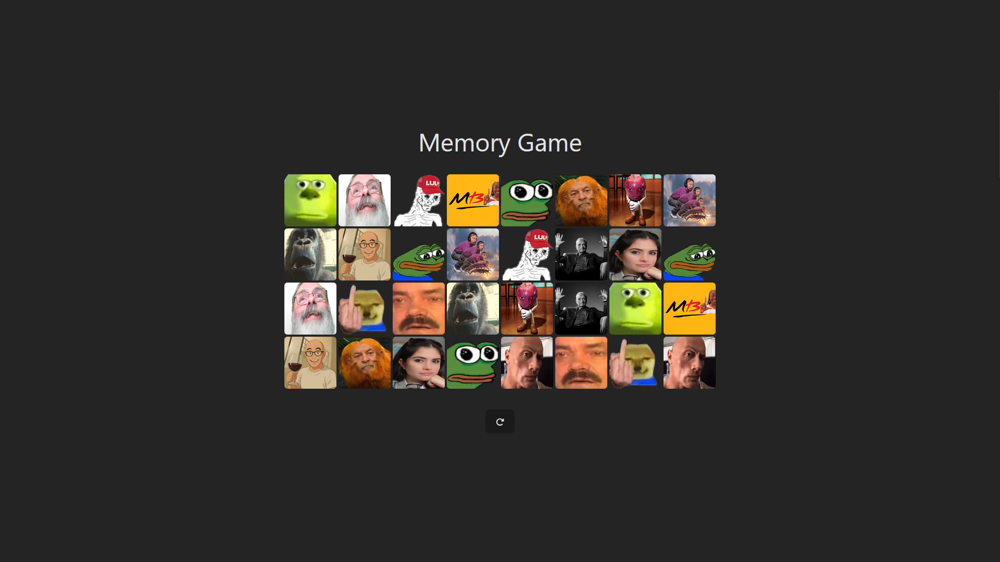

# Memory Game

A simple and fun memory matching game built with React, TypeScript, and Tailwind CSS. Flip cards to find matching pairs and test your memory skills!

## Table of Contents

* [Features](#features)
* [Getting Started](#getting-started)

  * [Prerequisites](#prerequisites)
  * [Installation](#installation)
  * [Running the App](#running-the-app)
* [Usage](#usage)
* [Customization](#customization)
* [Technologies](#technologies)
* [Contributing](#contributing)

## Features

* Shuffle and reset cards
* Flip cards to reveal images
* Match pairs to keep cards face-up
* Simple and responsive grid layout
* Restart game with a single click



## Getting Started

Follow these steps to run the project locally on your machine.

### Prerequisites

* Node.js (>= 14.x)
* npm (>= 6.x)

### Installation

1. **Clone the repository**

   ```bash
   git clone https://github.com/ultimatepexe/memory-game.git
   cd memory-game
   ```

2. **Install dependencies**

   ```bash
   npm install
   ```

### Running the App

Start the development server:

```bash
npm run dev
```

The app will open in your default browser at `http://localhost:<PORT>`.

## Usage

* Click on any card to flip it.
* Flip two cards to find matching pairs.
* Correct matches will remain face-up.
* Incorrect matches will flip back after a short delay.
* Click the reset button to shuffle and start a new game.

## Customization

* **Card Images**: Replace images in the `public/` folder.
* **Grid Layout**: Modify the Tailwind CSS classes in `App.tsx`.
* **Flip Delay**: Adjust the `setTimeout` duration in the `flipCard` function.

## Technologies

* React 18
* TypeScript
* Tailwind CSS
* Font Awesome

## Contributing

Contributions are welcome! Feel free to open issues or submit pull requests for improvements and bug fixes.